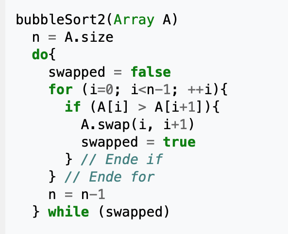

# Java 

## Sortier algorithmen

### Bubble Sort

Implementiere einen Bubble Sort Algorithmus!

Eine super Visualisierung zu Sortieralgorithmen findest du auf http://sorting.at/. 
Eine gute Erklärung zur Vorgehensweise des Bubble sort findest du auf Wikipedia: https://de.wikipedia.org/wiki/Bubblesort
